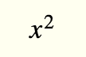
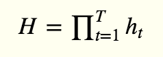
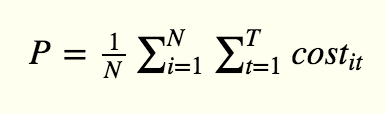

# Mathematical Symbols to Lovely code


```javascript
function square(x) {
    return x * x;
}
```


```javascript
function prod(h) {
    var ret = 1;
    for(var i in h) {
        ret *= h[i];
    }
    return ret;
}
var H = prod(h); // h is a 1-D array
```

```javascript
function nestedSum(cost, 1, T, 1, N) {
    var sum = 0;
    for(var i = 1; i <= N; i++) {
        for(var t = 1; t <= T; t++) {
            sum += cost[i][t];
        }
    }
    return sum;
}
var T = 20;
var N = 50;
var P = nestedSum(cost, 1, T, 1, N) / N; // cost is a 2D array
```
