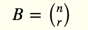
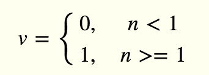

# Mathematical Symbols to Lovely code
Mathematical symbols are sometimes tricky to understand, they sometime pack a lot of information in them. This cheatsheet could help programmers understand those symbols in somewhat intuitive way.


```javascript
function square(x) {
    return x * x;
}
```


```javascript
function prod(h, _t, T) {
    var ret = 1;
    for(var t = _t; t <= T; t++) {
        ret *= h[t];
    }
    return ret;
}
var T = 100;
var H = prod(h, 1, T); // h is a 1-D array
```

```javascript
function nestedSum(cost, _t, T, _n, N) {
    var sum = 0;
    for(var i = _n; i <= N; i++) {
        for(var t = _t; t <= T; t++) {
            sum += cost[i][t];
        }
    }
    return sum;
}
var T = 20;
var N = 50;
var P = nestedSum(cost, 1, T, 1, N) / N; // cost is a 2D array
```

```javascript
function factorial(n) {
    var ret = 1;
    for (var i = 1; i <= n; i++) {
        ret *= i;
    }
    return ret;
}

var B  = factorial(n) / (factorial(n-r) * factorial(r)) 
```


```javascript
v = (n < 1) ? 0 : 1
```
